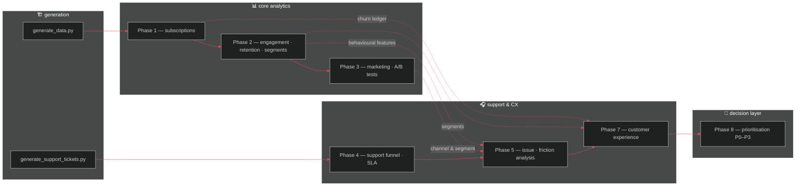

<div align="center">


<br/>


<br/><br/>

<a href="#-quickstart"></a>
<a href="#-quickstart"></a>
<a href="#%EF%B8%8F-built-by-hand-not-imported"></a>
<a href="#%EF%B8%8F-built-by-hand-not-imported"></a>
<a href="#-repo-map"></a>

<br/>

<sub>Status</sub>


</div>

<br/>

## 🧭 What this actually is

A subscription fintech/SaaS business, fully simulated end to end — **generation →
subscriptions → engagement → marketing → support → prioritisation** — where
*every single number in every chart traces back to a CSV in `data/`*. Nothing in
here is hand-typed or vibes-based.

> [!NOTE]
> No pandas. No scikit-learn. No `scipy.stats` / `statsmodels`. Wherever the brief
> called for statistics or clustering, it's implemented from first principles.
> Jump to [**⚙️ Built by hand**](#%EF%B8%8F-built-by-hand-not-imported) for the receipts.

<br/>

## 🌊 How data flows through it



<sup>Phase 6 was cut mid-project and never rebuilt — Phase 7 picks up straight after
Phase 5. Called out here rather than quietly renumbered.</sup>

<br/>

## 📖 Phase by phase

<details open>
<summary><b>🏗️ Phase 0 — Synthetic data generation</b></summary>
<br/>

50,000 customers · 56K subscriptions · 2.3M product events · 720K transactions ·
28K support tickets — relationally consistent, seeded, fully reproducible.

`scripts/generate_data.py` · `scripts/generate_support_tickets.py`
</details>

<details>
<summary><b>1️⃣ Subscription performance</b></summary>
<br/>

**46.7%** conversion · **$592K** MRR · **27.9%** churn · full MRR/ARPU/plan-mix
trend over time.

📄 <a href="outputs/business_summary.md">business_summary.md</a>
</details>

<details>
<summary><b>2️⃣ Engagement, retention & segmentation</b></summary>
<br/>

High-engagement subscribers retain **85.7%** at Month 12 vs. **0.9%** for
Low-engagement — the strongest single signal in the whole project. Six
behavioural segments, produced via rule-based RFM plus a from-scratch NumPy
K-Means.

📄 <a href="outputs/phase2_insights.md">phase2_insights.md</a>
</details>

<details>
<summary><b>3️⃣ Marketing funnel & A/B testing</b></summary>
<br/>

Full funnel, 91K impressions down to 1.3K paying customers · CAC/ROI by
channel · five experiments classified significant/not, backed by a
hand-written pooled z-test and Welch's t-test.

📄 <a href="outputs/phase3_recommendations.md">phase3_recommendations.md</a>
</details>

<details>
<summary><b>4️⃣ Support funnel & SLA</b></summary>
<br/>

28,411 tickets → **94.4%** resolved · **82.4%** SLA compliance · **3.81**
baseline CSAT.

📄 <a href="outputs/phase4_findings.md">phase4_findings.md</a>
</details>

<details>
<summary><b>5️⃣ Issue & friction analysis</b></summary>
<br/>

Payroll has the lowest usage of any feature — and the *highest* ticket rate.
Friction-per-use, not raw volume, tells the real story here.

📄 <a href="outputs/phase5_findings.md">phase5_findings.md</a>
</details>

<details>
<summary><b>7️⃣ Customer experience</b></summary>
<br/>

SLA breaches correlate with CSAT **5× stronger** than raw resolution time
(r = −0.484 vs. −0.091) · 255 of 256 issues show churn above baseline.

📄 <a href="outputs/phase7_findings.md">phase7_findings.md</a>
</details>

<details>
<summary><b>8️⃣ Issue prioritisation & business impact</b></summary>
<br/>

256 issues scored across 8 dimensions → bucketed **P0–P3** → ranked Top 5,
with an honest volume-vs-severity caveat baked directly into the write-up
rather than smoothed over.

📄 <a href="outputs/phase8_prioritization_summary.md">phase8_prioritization_summary.md</a>
</details>

<br/>

## ⚙️ Built by hand, not imported

<div align="center">

| The brief said "just import a library" | What's actually running |
|:--|:--|
| Two-proportion significance test | Pooled z-test from the raw formula, `math.erf` for the normal CDF |
| Confidence intervals | Wald CI with a hand-coded inverse-normal (Acklam's approximation) |
| Welch's t-test | Computed straight from means/variances, large-*n* normal approximation |
| K-Means clustering | Pure-NumPy Lloyd's algorithm, centroids ranked and hand-labelled into segments |
| Correlation analysis | Pearson *r* derived from first principles — no `scipy.stats.pearsonr` |

</div>

<br/>

## 🗂️ Repo map

```text
subscription-product-analytics/
├── subscription_product_analytics_full_pipeline.ipynb   ← the entire project, one notebook
├── README.md
│
├── data/                          8 CSVs — generated, not hand-written
│   ├── customers.csv              ├── product_events.csv
│   ├── subscriptions.csv          ├── transactions.csv
│   ├── marketing_campaigns.csv    ├── customer_campaigns.csv
│   ├── experiments.csv            └── support_tickets.csv
│
├── outputs/
│   ├── charts/                    57 PNGs
│   ├── tables/                    98 CSVs
│   └── *.md                       one findings/recommendations doc per phase
│
└── scripts/                       source .py the notebook is assembled from
    ├── build_notebook.py          run after editing a script to rebuild the notebook
    └── ...                        one generation/analysis script per notebook section
```

> The notebook is the single entry point — every phase runs top to bottom in one
> file. `scripts/` holds the underlying source for editing or running a phase
> standalone; it isn't meant to be read as a separate deliverable.

<br/>

## 🚀 Quickstart

```bash
pip install polars numpy matplotlib seaborn nbformat nbclient ipykernel

# run the whole project end to end
# (generation cells auto-skip if data/ already exists)
jupyter nbconvert --to notebook --execute subscription_product_analytics_full_pipeline.ipynb

# or open it interactively
jupyter lab subscription_product_analytics_full_pipeline.ipynb
```

<br/>

## 🔎 A finding worth reading twice

> Across Phases 5, 7, and 8 the same tension keeps resurfacing: **raw ticket
> volume and genuine customer friction point to different issues.** The
> highest-volume tickets tend to be routine and well-rated; the worst
> experiences hide in low-volume, high-severity issues a volume-only view
> would never surface. Phase 8's Top-5 table keeps both readings visible
> instead of collapsing them into one misleadingly tidy ranking — see the
> honesty check in
> [`prioritization_summary.md`](outputs/phase8_prioritization_summary.md#top-5-ranked-product-issues).

<br/>

<div align="center">

**Phases 1–8 shipped** · Phase 9 (executive report) not yet started


</div>
