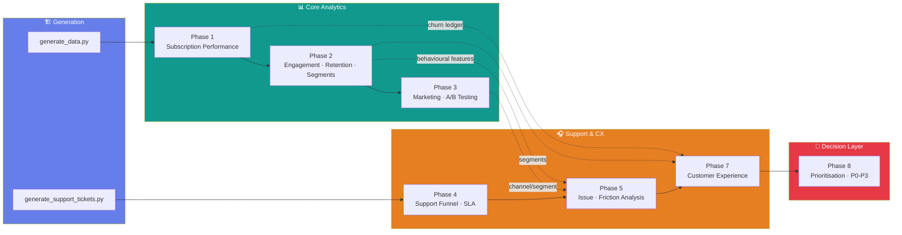

<div align="center">


<br/>


</div>

<br/>

## What is this?

A complete, self-generated analytics project simulating a subscription fintech/SaaS
product end-to-end: **synthetic-but-realistic data generation → subscription
performance → engagement & retention → marketing/experimentation → support &
customer experience → issue prioritisation.** Every number in every chart is
computed from the CSVs in `data/` by the scripts in this repo — nothing here is
hand-typed.

No pandas. No scikit-learn. No scipy.stats / statsmodels. Where the brief called for
statistics or clustering, they're implemented from first principles — see
[`⚙️ Built by hand`](#️-built-by-hand-not-imported) below.

<br/>

## 🗺️ Pipeline at a glance



> No Phase 6 exists in this project — Phase 7 continues directly from Phase 5. Flagged
> explicitly rather than silently skipped.

<br/>

## 📦 Phase-by-phase

<table>
<tr><th>Phase</th><th>Focus</th><th>Headline output</th><th>Docs</th></tr>

<tr>
<td>🏗️ <b>0</b></td>
<td>Synthetic data generation</td>
<td>50,000 customers · 56K subscriptions · 2.3M product events · 720K transactions · 28K support tickets — all relationally consistent, seeded, reproducible</td>
<td><code>generate_data.py</code><br/><code>generate_support_tickets.py</code></td>
</tr>

<tr>
<td>1️⃣</td>
<td>Subscription performance</td>
<td>46.7% conversion · $592K MRR · 27.9% churn · full MRR/ARPU/plan-mix trend</td>
<td><a href="outputs/business_summary.md">business_summary.md</a></td>
</tr>

<tr>
<td>2️⃣</td>
<td>Engagement, retention, segmentation</td>
<td>High-engagement subscribers retain <b>85.7%</b> at Month 12 vs <b>0.9%</b> for Low — the strongest single signal in the whole project. 6 behavioural segments via rule-based RFM + from-scratch NumPy K-Means</td>
<td><a href="outputs/phase2_insights.md">phase2_insights.md</a></td>
</tr>

<tr>
<td>3️⃣</td>
<td>Marketing funnel & A/B testing</td>
<td>Full funnel (91K → 1.3K paid) · CAC/ROI by channel · 5 experiments classified significant/not, with hand-written z-tests & Welch's t-test</td>
<td><a href="outputs/phase3_recommendations.md">phase3_recommendations.md</a></td>
</tr>

<tr>
<td>4️⃣</td>
<td>Support funnel & SLA</td>
<td>28,411 tickets → 94.4% resolved · 82.4% SLA compliance · 3.81 CSAT baseline</td>
<td><a href="outputs/phase4_findings.md">phase4_findings.md</a></td>
</tr>

<tr>
<td>5️⃣</td>
<td>Issue & friction analysis</td>
<td>Payroll: lowest usage of any feature, <i>highest</i> ticket rate — friction-per-use, not raw volume, tells the real story</td>
<td><a href="outputs/phase5_findings.md">phase5_findings.md</a></td>
</tr>

<tr>
<td>7️⃣</td>
<td>Customer experience</td>
<td>SLA breach correlates with CSAT <b>5x</b> stronger than raw resolution time (r=-0.484 vs -0.091) · 255/256 issues show churn above baseline</td>
<td><a href="outputs/phase7_findings.md">phase7_findings.md</a></td>
</tr>

<tr>
<td>8️⃣</td>
<td>Issue prioritisation & business impact</td>
<td>256 issues scored on 8 dimensions → P0-P3 · ranked Top 5 with an honest volume-vs-severity caveat baked into the write-up</td>
<td><a href="outputs/phase8_prioritization_summary.md">phase8_prioritization_summary.md</a></td>
</tr>

</table>

<br/>

## ⚙️ Built by hand, not imported

<div align="center">

| Where the brief said "use a library" | What's actually running |
|---|---|
| Two-proportion significance test | Pooled z-test from the raw formula, `math.erf` for the normal CDF |
| Confidence intervals | Wald CI with a hand-coded inverse-normal (Acklam's approximation) |
| Welch's t-test | Computed from means/variances directly, large-*n* normal approximation |
| K-Means clustering | NumPy-only Lloyd's algorithm, centroid-ranked and hand-labelled into business segments |
| Correlation analysis | Pearson *r* from first principles, no `scipy.stats.pearsonr` |

</div>

<br/>

## 📁 Repo structure

```text
subscription-product-analytics/
├── generate_data.py                          # core dataset generation (Phase 0)
├── generate_support_tickets.py               # support ticket generation
├── analyze_subscriptions.py                  # Phase 1
├── phase2_engagement_retention_segmentation.py
├── phase3_marketing_experiments.py
├── phase4_support_funnel_sla.py
├── phase5_issue_friction_analysis.py
├── phase7_customer_experience_analysis.py
├── phase8_issue_prioritization.py
├── build_notebook.py                         # assembles everything below into ↓
├── subscription_product_analytics_full_pipeline.ipynb   # ← run this for everything
│
├── data/                                     # 8 CSVs, generated not hand-written
│   ├── customers.csv          ├── product_events.csv
│   ├── subscriptions.csv      ├── transactions.csv
│   ├── marketing_campaigns.csv├── customer_campaigns.csv
│   ├── experiments.csv        └── support_tickets.csv
│
└── outputs/
    ├── charts/            # 57 PNGs
    ├── tables/             # 98 CSVs
    └── *.md                # one findings/recommendations doc per phase
```

<br/>

## 🚀 Quickstart

```bash
pip install polars numpy matplotlib seaborn nbformat nbclient ipykernel

# Everything, end to end (generation is skipped automatically if data/ already exists)
jupyter nbconvert --to notebook --execute subscription_product_analytics_full_pipeline.ipynb

# ...or run any single phase directly
python phase8_issue_prioritization.py
```

<br/>

## 🔍 A finding worth reading twice

> Across Phases 5, 7, and 8, the same tension keeps resurfacing: **raw ticket volume
> and genuine customer friction point to different issues.** The highest-volume
> tickets are routine and well-rated; the worst experiences hide in low-volume,
> high-severity issues that a volume-only view would never surface. Phase 8's
> Top-5 table keeps both readings visible rather than collapsing them into one
> misleadingly tidy ranking — see the honesty check in
> [`phase8_prioritization_summary.md`](outputs/phase8_prioritization_summary.md#top-5-ranked-product-issues).

<br/>

<div align="center">

**Phases 1–8 shipped** · Phase 9 (executive report) not yet started


</div>
